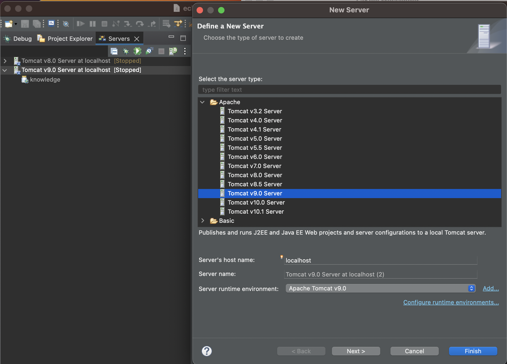

# Knowledge

[](https://travis-ci.org/support-project/knowledge)


## About
- **UNOFFICIAL** Free Knowledge Management System
- [landing page and Online manual](https://information-knowledge.support-project.org/)
- As original repository does not look to be maintained, I update it unofficially.

### Differences

- [Dialog support](https://github.com/support-project/knowledge/pull/1104)
- [`<details>` tag support](https://github.com/support-project/knowledge/pull/1107)
- [Simplify search result ](https://github.com/support-project/knowledge/pull/1110)


## Support
- **日本語での質問は、以下のサイトに登録してください(海外からのアクセスが多くなったため)**
- **For questions in Japanese, please register below**
- https://service-knowledge.support-project.org/

## Live Demo
- [https://test-knowledge.support-project.org](https://test-knowledge.support-project.org)
- Demo users
   - [id/password] user1 / user1
   - [id/password] user2 / user2
   - [id/password] user3 / user3


## Deploy to Heroku

[](https://heroku.com/deploy?template=https://github.com/support-project/knowledge)


## How to initial set up
- Please show the [wiki page](https://github.com/support-project/knowledge/wiki)


## Developer manual


## Debug with Eclipse & Tomcat

1. Download Eclipse
2. Download the following from the Eclipse Market place and restart Eclipse
   - Eclipse Tomcat Plugin 9.1.4
   - Eclipse Web Developer Tools 3.30
   - Eclipse JST Server Adapters (Apache Tomcat, JO nAs, J2EE) Luna
   - Eclipse Enterorise Java and Web Developer Tools3.30
3. Set Java in Eclipse Preferences to JDK8(1.8) 
4. Download [Tomcat9](https://tomcat.apache.org/download-90.cgi) locally and set it as Tomcat Server





5. Add "Knowledge" to Tomcat Server and start the server with debug button
6. Access with "http://localhost:8080/knowledge"

<br>

https://koda3.hatenablog.com/entry/2015/04/08/061130

### Build manually

you can build knowledge.war with mvn command;

**Java Version**

```sh
$ java -version
openjdk version "1.8.0_292"
OpenJDK Runtime Environment (AdoptOpenJDK)(build 1.8.0_292-b10)
OpenJDK 64-Bit Server VM (AdoptOpenJDK)(build 25.292-b10, mixed mode)
```

**CPMMAND**

```sh
$ mvn install -DskipTests=true -Dmaven.javadoc.skip=true -e -Djava.net.useSystemProxies=true
```

### ER diagram

You can see ER diagram at document/database (in Japanese).

## vulnerability testing
- vulnerability testing with VAddy
<a href="https://vaddy.net/" target="_blank">
</a>
# Knowledge

[](https://travis-ci.org/support-project/knowledge)


## About
- **UNOFFICIAL** Free Knowledge Management System
- [landing page and Online manual](https://information-knowledge.support-project.org/)
- As original repository does not look to be maintained, I update it unofficially.

